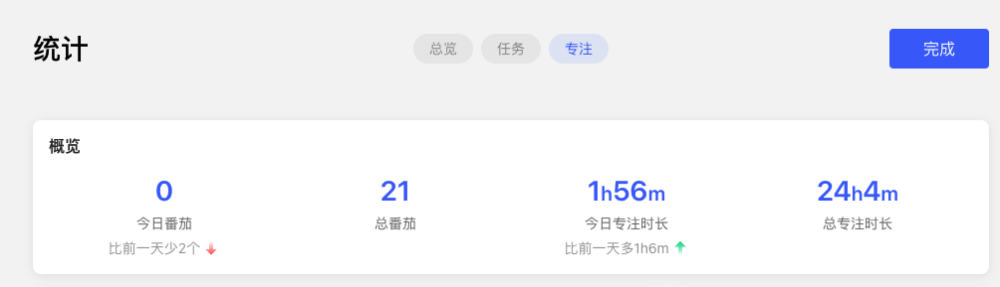

最近想改善一下自己的待办处理流程，于是又开始折腾GTD，即Get Things Done，把事情做完

稍微搜索一下GTD，就能找到各式各样的方法论和工具，与之同屏出现的还有「效率」「个人成长」「自我管理」等等词语，让我有种如果要精进自己，就得掌握GTD的感觉

[在滴答清单中实践 GTD | 帮助中心 - 滴答清单](https://help.dida365.com/tasks/a/6427792882765135872/%E5%9C%A8%E6%BB%B4%E7%AD%94%E6%B8%85%E5%8D%95%E4%B8%AD%E5%AE%9E%E8%B7%B5%20GTD) 中有更为详细的步骤，不过在我眼里，GTD不仅仅是一种方法论，更是一种理念：

让待办事项更有条理地被完成。它包含着一系列相关动作：新增一项待办，附加各种属性，在完成的时候打上勾

但从我目前的体验和对旁人的观察，有无依据GTD的理念做事，其实都不影响一个人的正常生活

- 该做的事情，例如工作上的任务，不管有没有列出来，都会被外部push去做
- 想做的事情，例如读书、学习、写作，即便列出来了，不想做的时候，还是会选择拖延

完全不会因为没有把todo列出来就不去做，也不会因为把todo列出来就一定去做。磨刀不误砍柴工，最重要的还是砍柴，而不是磨刀，过分追求效率反倒容易陷入「效率成瘾」，见[年度征文 | 我是如何艰难地克服「效率成瘾」的？ - 少数派](https://sspai.com/post/71518)

简而言之，在我眼里，GTD并不能让我更高效地去做必做之事，也不会让我不再拖延
<!--more-->

##### GTD的价值在于备忘

既不能提高做事效率，又不能克服拖延，那GTD有何用？

在我眼中，GTD的价值在于备忘，它本质上只是一些待办任务，提醒我有这么一件事情要去做。它可以

- 早晨起床时，在我不知道今天要做啥的时候，有相应的选择
- 遇到突发事项或者有新的“三分钟热度”想法时，可以和当前正在做的事情进行一个优先级排序

相信大家都清理过杂物，过程中总能发现一些尘封已久的物品。我们的注意力总是在离我们最近的事物中，时间上是刚用完的电子产品，空间上是触手可及的水杯，那些不常用又不在眼前的东西，自然而然就被遗忘。

待办也一样，我们的注意力和优先级排序，往往不是根据事情的重要性，而是看哪样离我们最近，例如工作中，常常会放下手头正在做的任务，去处理当面找过来的问题。如果当前任务只是延误了下还好，但如果某些任务没被记录下来，因为看不见，很容易就会忘记了

所以，如果没有统一收集这些待办，疲于应付当前事项，那些想做的事情可能因为一直看不到，就再也不会去做了。

这就是我所理解的GTD的核心价值——备忘，同时因为有记录，得以比较优先级

##### 如何更有条理的完成待办

把待办记录下来，接着就是要去完成它

- 有些事项简单到可以几分钟搞定
- 有些事项复杂到可以拆分成几个小任务，甚至还要跨几天甚至更长的周期
- 有些事项的执行需要依赖各种条件
- ……

以上的一切考虑，其实都是在进行「分类」，这也是各类GTD方法论的不同之处所在

- 譬如四象限，将事情依据重要程度、紧急程度进行划分
- 譬如精力，将事情依据耗费精力的多少进行划分
- 譬如时长，讲事情依据占用时间的多少进行划分

各种教导如何更有条理地处理待办，其实都是在「分类」上做动作，而且目前还没有出现一统天下的方法论，说明「分类」本身就不好做，不管怎么分都无法满足所有的需求。再加上「分类」这件事本身就是有成本的，可能我给任务附加上属性的复杂度比这件事本身更大

所以我总在想，能不能不分类，即：我就只有一份清单，里面列满待办，附上一些简单的属性就直接开干。而且一旦进行了分类，就会下意识对任务进行挑选，与其挑来挑去，不如就粗暴地按照「后进先出」，逐个击破，如果发现该项任务暂时无法处理，直接拖拽到后面，这也是待办列表最基础的模样

##### 我的实践

以上则是我当前的GTD理念，纯粹备忘+无脑执行，遇到大一点的事项，就拆分成多个子任务。因为需求足够简单，常见的清单工具，都可以胜任。

目前在用的是「滴答清单」，所有任务都放到「收集箱」里，通过「标签」增加属性。最主要的是「专注」功能，或者说番茄计时/正计时功能，可以辅助记录我处理某项事情所耗费的时间

理念随时会变，持续迭代，持续调整

