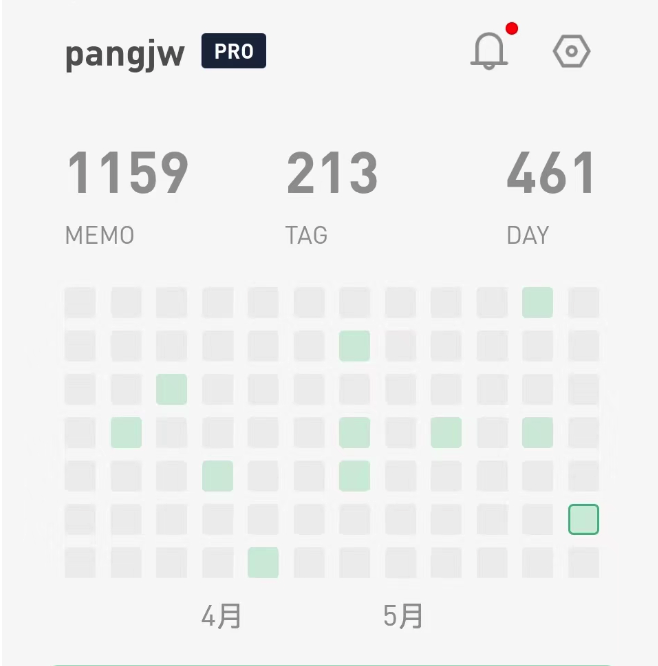
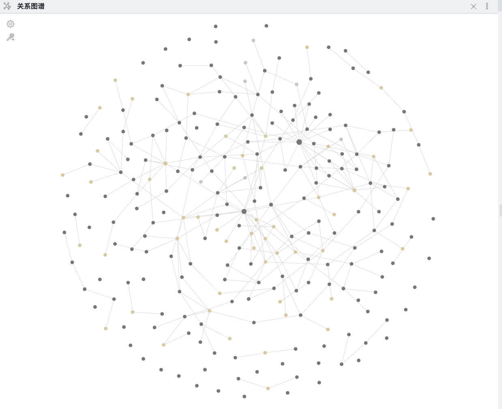

「持续不断记录，意义自然浮现」。这是笔记软件flomo的一个slogan

曾经有段时间，我在高频用flomo，不过自从发现了obsidian之后，flomo逐渐吃灰

不是flomo不好用，只是obsidian的本地化+丰富的插件更契合我的喜好。如今单纯使用flomo在移动端做点灵感的捕获。当需要端坐在电脑前认真做笔记的时候，还是首选obsidian。工具不重要，我只是喜欢这句slogan，「**持续不断记录，意义自然浮现**」
<!--more-->

### 我的记录习惯

在我的记录习惯里，有两个重要组成，一个是日记，一个是每周思考。

1）日记

日记持续写了四五年，始于大学时期，变换过各种形式，折腾过各种工具软件。我是完全没想到能坚持到现在，以前我非常佩服那些从小就坚持写日记的人，觉得他们特厉害，当我也写了四、五年日记的时候，才发觉也没什么，和那些不写日记的朋友并没有太大差别。

我只是单纯的写，基本不翻看以前写的文字，我写日记最大的动机，是担心当我想回味过去的时候，没有拿得出来的东西，我会遗忘那些曾经印象深刻的事情，当时的内心感受，以及每天浮现出的各种奇奇怪怪的想法。我不知道除了留存感受和记忆之外还有什么其他意义，但我相信：**持续不断记录，意义自然浮现**

2）每周思考

每周思考是去年才开始写的。日记是记录发生的事情，是经历是情绪是感受，但我认为人还是需要一段独处时间进行思考的，要反思要复盘要总结，于是就有了这个每周思考，围绕某个特定的话题写下自己的理解。既然是“思考”，那还是有点门槛的，需要时间、精力的投入

这篇是第89篇，在这个过程中，碰到了一些问题

最大的问题是频率的保持。一开始我想要保持一周一更的频率，正如标题所言，每周思考。我原以为我可以在周中做好素材的收集，周末直接输出，但渐渐发现，思考与表达需要的时间总是比我预想的要多，如果周末再碰上事情，就会拖到周日晚上才开始，成果自然是流水帐。上两周刚好有点其他高优的事情需要处理，直接就没产出

其次是写作内容。一开始信心满满，但写了几篇把肚子里的想法和墨水输出完了之后，便陷入了创作的荒漠。工作日碰到的事情都比较琐碎，需要时间才能深挖出价值，往往还没来得及梳理又到了写作的时间，写出来的内容都是想当然的，流于空谈

碰上上述问题让我意识到，时间是最大的矛盾，我想要提高质量，但是又没有投入充足的时间。投入了时间，我的表达能力也还没到位。为了让事情得以推进，我应该做出调整

首先这不是投入更多的时间就能解决的问题（客观条件也不允许投入无限制的时间）。于是想到了我应该从内容入手。或许这也是我的问题所在——我想写的范围太大了，是话题级别的，涉及到面，翻看以前写过的关键词，“财务自由”、“阅读”、“专注”等等。一个话题牵扯的内容实在太多，啥都想沾点边，理清楚都需要很长的时间，表达出来也很费力，进一步造成了我时间不够。

因此，我应该聚焦于某一个小点，思考某个具体的问题，并进行简单的延伸。问题的规模小，需要的时间就少，也能驾驭。也只有这样，才能更好的做到**持续不断记录**

### 我想追加的记录习惯

除了日记和每周思考，我还想增加「卡片笔记」和「工作日志」

1）卡片笔记

这个概念是被flomo安利的，更多内容可以在《卡片笔记写作法》里找到，obsidian也有卡片笔记的插件，但我的笔记体系转移到obsidian就少用了。目前只有一些比较“严肃”的笔记，通常在电脑前学习才会有记录。日常想到的灵感，如果晚上写日记的时候没有写下来，很可能就遗忘了。

比起卡片笔记本身的一系列方法论，我关注的是，如何把卡片笔记嵌入到我的记录习惯里

在我的这个记录系统中，卡片笔记是处于日记和每周思考中间的一个角色。日记的文字过于随意，只是为了留下第一手材料。每天或多或少都有一些值得深挖的点，完全可以在写日记的时候，挑几点出来，提炼成卡片笔记，然后在每周思考里进一步拓展。

曾经用flomo的时候有做过类似的尝试，但在每周思考的时候，遇到了内容组织的问题，因为卡片有点多，相互之间都凑不成一个话题，又不想割舍，所以有一段时间，每周思考变成了很多个卡片的汇总。字数是轻松凑上去了，但这个不是我想要的形态，所以也没从这个方向迭代下去

抛开每周思考，从一个更长期的视角，积累卡片笔记是很有必要的，特别是我这种喜欢记录的人，虽然目前我所积累的卡片笔记没能让我写出一本书，但我相信有这么一天的存在。

2）工作日志

工作日志主要是记录工作中的一些事情，因为在准备面试以及准备晋升材料的时候，发现自己能回溯的素材少得可怜，而且工作中做某些事情，肯定会有对应的文档，一个非常典型的场景是：印象中做某件事有这么一个文档，但是不知道在哪里，于是到处搜索聊天记录和问人，花了不少力气才找到

这让我意识到一个问题，我的工作和与之相关的各类信息、副产品都没有被妥善管理起来，散落在多个群的聊天记录里、找不到链接的文档里，以及那些临时涂写的白板上。每每想到这些信息都丢失了就有点心疼

所以就想通过工作日志这个方式，记录正在做的事情以及相关信息，和同事的讨论，某些会议的纪要，以及一些新发现等等。目前已经在做相关的尝试，但还需要点时间进行沉淀

### 重要的是写下来，写到就是赚到

于是我的体系就有了四个组成

- 每天工作时的工作日志（线）
- 每天睡前的回顾日记（线）
- 从上述两者提炼出来或者学习过程中产生的卡片笔记（点）
- 每周独处的每周思考（点/线）

一个显而易见的事实，做记录总归是耗时的

有些人认为没有必要，有这些时间，已经做了很多事情了。我个人还是喜欢把一些东西给记录下来，尽管有些东西看起来无用，但提供了后续分析的可能。就和数据埋点一样，不管有用无用，先把数据积累下来，后续才有机会看到效果。啥都没有，啥也做不了

有些人觉得做记录是个好习惯，但枯燥的一天没觉得有值得记录下来的事情，认为自己又浪费了一天。也有的人比较敏感，很多东西都想写，内容太多反倒成了负担。

我对记录这件事情的态度，始终是：写到就是赚到。不管有没有东西写，写了好过没写，东西太多就简单写。写到就是赚到，不用怕从此找不回来。还是那句话：「**持续不断记录，意义自然浮现**」

最后附上obsidian上的关系图谱

