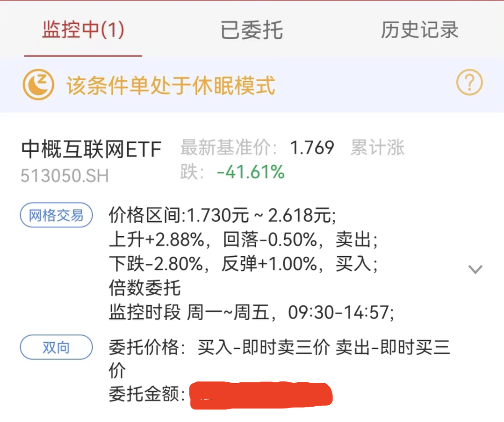
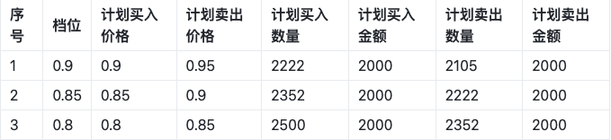

### 缘由

在「也谈钱」的公众号推文里看到了网格交易，[钱不多，但感觉挣了一个亿](https://mp.weixin.qq.com/s/CGaYQcAFPVm0T0MPE_ax8g) ，有点手痒，又想折腾网格交易了

去年第一次做网格的时候抄某“大V”作业，做中概网格，没过多久就碰上了大跌，到现在一年多了还浮亏40+%

因为浮亏太久，已经好久没碰券商APP了，一直在装死。回想起来，大环境影响固然很大，但最核心的问题在于一个错误的操作——建底仓。

之前抄的网格作业会先建底仓，即根据当前的价格，买入比一网大好几倍的仓位，以这个为基准进行后续的网格交易。如果后续的行情是一路上涨，我肯定非常认可建底仓，毕竟能赚更多，然而后续是断崖式的下跌

建底仓的问题在于太集中了。网格交易本身赚的就是上下波动的钱，一次性集中买入比一网大得多的资金量，而且条件单的设置又还是一网大小的卖出，除非连续上涨很多倍，才有机会清空持有的资金量，遇上下跌，则会买入更多

一个人的经历太影响观念了，这次好在总体资金量还小，反思总结，有助于减少后续发生更大的亏损。已经发生的无法避免，重要的是调整心态和策略，再来一次

这次认认真真的看了E大关于网格策略的三篇文章

- [# 波段策略.网格之一：写在前面、体系以及策略](https://mp.weixin.qq.com/s/uxktt5ZpNo03FpQQX-aG7g)
- [# 波段策略.网格之二：网格策略基础/1.0版](https://mp.weixin.qq.com/s/-czfqGvxkDcay_tSI1jv5g)
- [# 波段策略.网格之三：网格策略进阶/2.0版](https://mp.weixin.qq.com/s/8pRKsjiQSZzrmH-uWCkRLQ)

磨刀霍霍向网格

<!--more-->

### 对网格交易的理解

关于网格交易的理念与操作，E大的文章讲的已经十分到位了，我再啰嗦重复的意义不大，比起“摘抄”知识点，我更想结合实际的投资经历去理解网格交易

长期来看，市场是上涨的。我在关注的投资博主，似乎都在说着类似的话，例如孟岩、例如E大、例如也谈钱。只是多久算长期？似乎都没有标准答案。孟岩前天发了实证的5周年总结，[# 五年的实证，告诉了我们什么](https://mp.weixin.qq.com/s/GJIGtzpeKgOPYM1dzJyaBA)

> 从 2017 年 9 月到 2022 年 8 月，孟岩投资实证总投入资金大概 500 万左右，累计收益在 215 万左右，用 XIRR 方式计算的年化收益率为 8.01% 

5年的时间，说长不长，说短不短，从结果来看确实是上涨的，虽然没理解年化收益的计算逻辑，但是500万赚215万还是超出了我的预期。

也正是信奉「长期来看，市场是上涨的」，我才持续定投了4年多，资金量远没有500万，但我相信时间会给我带来惊喜。既然不随意折腾也能赚到还不错的收益，为什么我还要折腾网格？

1）

首先，长期来看，市场是上涨的，但是这中间的过程，一定伴随着波动，如果眼里只有上面实证总结的起点和“终点”，中间过程一定会错过许多。而且如果信奉投资的长期主义，基本意味着没有终点，因为多久算长期的核心问题并没有得到答案

正如我的定投，就是一场还不确定终点在哪里的投资旅行。不是多么信奉长期主义，只是从开始就没有想好卖出的时机是什么。在目前的我看来，这样的投资理念其实是不合格的，没有落袋为安的投资就不是一笔好的投资，只有买没有卖，连买卖都算不上

当然这个问题不一定得现在解决，参考也谈钱的财务自由实证，或许到了我财务自由的那一刻我就会找到合适的卖出时机。但是这个过程，总不能一直只有买没有卖吧，结合市场波动的确定性，看到网格交易，我就觉得网格交易是比较容易上手的学习投资的方法，有明确的买点、卖点和收益目标，真正做到落袋为安

2）

其次，网格交易可以作为长期策略的补充，增加更多的收益。这样收益结构就是长期上涨的钱+波动的收益，比单纯的长期上涨收益要丰富一些

既然波动收益是确定的，长期收益的时间和幅度都没有办法确定，为什么E大不把更多的仓位放到网格来获取相对确定的收益，却建议要以长期投资为主、短期网格为辅呢？看完E大的文章，一个认识是：核心的重仓要用来等牛市的到来，保持耐心。

还没遇到过牛市的我，能看懂意思但无法有深刻的理解。既然有经验的E大都这么说了，我这种初入行的小菜鸡也没有必要继续踩坑

### 网格实操

在E大的文章中有很详细的操作说明

1. 确定交易品种
2. 列出网格表格
3. 做压力测试
4. 设置交易提醒
5. 按照交易提醒进行交易

#### 1. 确定交易品种

E大给出的交易品种底线：不会死。就是不会像个股那样存在退市风险

思来想去，既然E大是专门做ETF指数基金的，指数似乎就是个不会死的品种，于是直接在指数基金里面做选择。那么多指数基金，选哪个呢？

首先还是选熟悉的，我之前操作过的ETF有，券商ETF、中概互联ETF、传媒ETF、恒生ETF，中概已经重仓了直接pass，然后券商ETF就进入了我的眼里。纯属个人看法，券商行情是有相对明确的波动行情的，牛市来了大家都在讨论股票，券商热度升高，熊市来了大家都在装死，券商热度降低

那还是选券商ETF吧

#### 2.列出网格表格

E大有说明的项有，交易价格、交易金额、交易日期。这里面我感觉交易日期作用不大，因为没有办法预测哪天能到达目标的价位，如果只是单纯为了记录达成交易的时间，券商APP也能做到。所以当前列出的表格就省了

关于交易价格，这个细节和我最开始的理解有点出入。根据当前的价位0.857，差不多就是0.85这个档买入，我原以为卖出的价格会是价格的5%，也就是0.85 + 0.85 * 0.05 = 0.8925 ，然后如果在0.8925买入的话，那么再乘上5%，也就是0.8925 + 0.8925 * 0.05  = 0.937125。每一网格的大小都是妥妥的5%

但根据E大的表格，以1为基准算5%就是0.05，每一个网格都是0.05的差值，如果是0.85买入，卖出价格会是在0.9，收益5.8%，1.2买入的话，卖出价1.25，收益4.1%。这样的设置意味着不同的买入价位，实际收益率都不太一样。这是和我最开始对网格收益大小理解不一样的地方

然后是关于交易的金额，因为5%的网格大小，1000块其实也只能赚50块左右，我的目标是赚100块，所以就增加了资金量，每次买卖2000块，其中只卖出2000块是为了留子利润，因为收回本金之后剩下的都是赚来的钱，即使亏了也不会太心疼。另外也不逐格加码了，毕竟要增加投入的资金，还是见好就收

于是在当前价位上下一格列出的网格，大概就长这样，因为还没下跌到0.85，也不知道会不会一直涨到0.9

#### 3.压力测试

压力测试是E大一直在强调的，自然也不能省。我完全不知道最大的下跌幅度到哪里，但是可以参考历史的最高和最低

在APP可以看到，历史最高1.335，历史最低0.584，中点则是0.9595，当前价位是0.857，还算便宜

-   下跌30%即到达历史最低附近
-   上涨55%到达历史最高

感觉是个比较合适的买点，最坏情况下跌40%，到达0.5142，假设5%一网，一网2000块，最后一网价格在0.5，共买入8网，需要资金1.6w。也就是说最坏情况，一直买入8网，然后像中概一样一瘸不振，我无法想象下跌40%时我的真实感受，但从资金量的角度也只是被套牢1.6w资金，还算可以接受吧（毕竟中概都这样过来了

#### 4. 设置交易提醒和交易

这个因为是挂的条件单，程序会自动监控执行，我需要做的只是提前设置好价格条件单，然后吃喝玩乐

### 最后

希望这次顺利